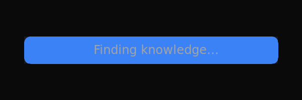

## Visual Design Alignment with Memoria Design System

This PR aligns the Rekoll website with the **memoria-design** system — a design language for premium, dark-themed knowledge interfaces.

### Design Philosophy

> "Numbers are heroes, labels are whispers."

The design now follows these core principles:
- **Hierarchy through restraint** — Size and opacity create importance, never color
- **Data speaks first** — Large metrics dominate, supporting text recedes
- **Sequential revelation** — Elements wake up one by one
- **Confident emptiness** — Whitespace is intentional
- **Invisible interaction** — Hover states reveal, not decorate

### Changes Made

**Removed AI Slop:**
- ❌ Blue/purple gradient border on search box (violated "No gradients")
- ❌ Glassmorphism in navbar (violated "Every pixel earns its place")
- ❌ Decorative border-beam animation on cards (decorative, not purposeful)
- ❌ Inter font (overused, generic)

**Applied Memoria-Design Rules:**
- ✅ Monochromatic palette only (no accent colors)
- ✅ Light font weights for large text (`font-light`)
- ✅ Size/opacity hierarchy (no bold for emphasis)
- ✅ Geist font (modern, distinctive)
- ✅ Blur-to-clear text animations (sequential revelation)
- ✅ Clean hover states (border brightens, no decorative effects)

### Visual Comparison

| Before | After |
|--------|-------|
|  |  |

**Before:** Generic AI aesthetic with blue gradient hover effect, glassmorphism, overused Inter font

**After:** Surgical precision aesthetic following memoria-design — monochromatic, purposeful, restrained

### Design Context

See `.impeccable.md` for full design context. Key attributes:
- **Users:** Privacy-conscious, technically literate
- **Personality:** Sharp / Smart / Trustworthy
- **Aesthetic:** Surgical precision meets understated elegance
- **References:** Linear, Obsidian, Arc Browser

### Checklist

- [x] No gradients
- [x] No glassmorphism  
- [x] No decorative border effects
- [x] Monochromatic palette only
- [x] Light font weights for headings
- [x] Sequential animation reveals
- [x] Purposeful hover states only
